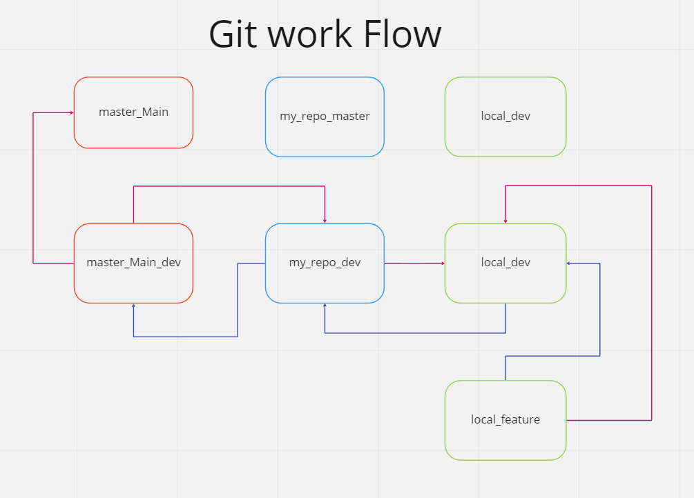
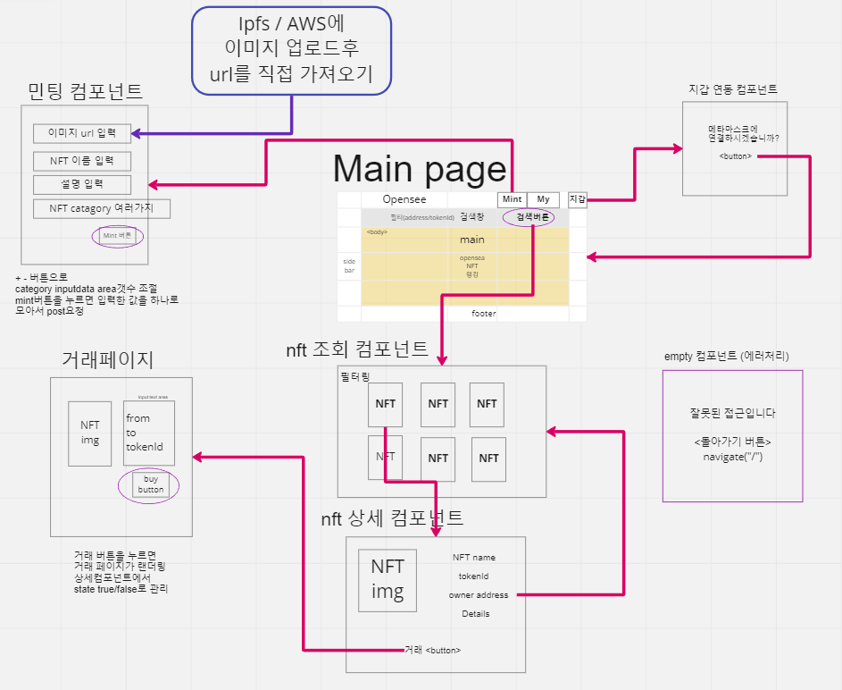
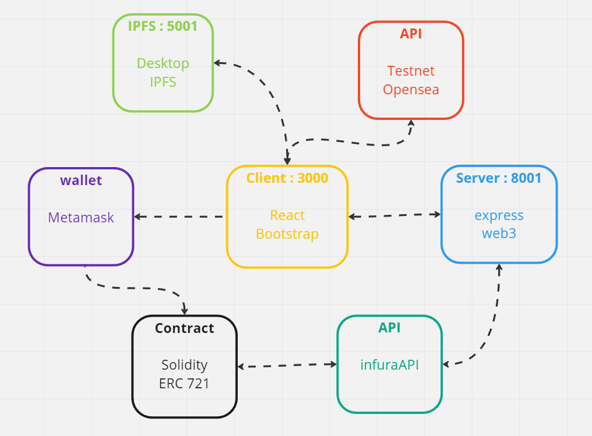

 

### 👋&nbsp;introduce
&nbsp;&nbsp;&nbsp; 코드스테이츠 BEB 6기 3조입니다! 
&nbsp;&nbsp; 지난 4개월여간 우리가 배워온 지식들과 실제 서비스중인 **OpenSea**를 분석하여 
&nbsp;&nbsp; NFT를 발행하고 서로 주고 받을 수 있는 웹 어플리케이션을 구현하고자 합니다. 
&nbsp;&nbsp; 스마트 컨트랙트를 블록체인 네트워크에 배포하고  
&nbsp;&nbsp; web3 라이브러리와 연동하여 서버를 구축하고  
&nbsp;&nbsp; 우리가 만들어낸 서버로와 통신하는 웹 페이지를 구현하는 것은 
&nbsp;&nbsp; 팀원 모두에게 있어서 첫번째 도전입니다. 
&nbsp;&nbsp; 이번 프로젝트를 통해 블록체인을 다루는 개발자로서 한발을 내딛어 
&nbsp;&nbsp; 저희의 장래의 가능성을 열어볼(**OpenSee**) 것입니다.
 

 

### 📝&nbsp;Roles
||||
|---|---|---|
**이민욱** | 프론트엔드(팀장) | https://github.com/yiminwook 
**조은석** |프론트엔드 |https://github.com/noncontact
**한은진** |백엔드&스마트컨트랙트 | https://github.com/eunjh3

 

### 📒&nbsp;Rules
&nbsp;&nbsp; 회의는 오전 11시에 진행 
&nbsp;&nbsp; 커밋은 한글로 간결하게 작성하고, 기능구현시마다 작성 
&nbsp;&nbsp; 고민이 될때는 항상 팀원들과 상담!
 
 

### ♻️&nbsp;Workflow

  

 
 
 
### 🛠&nbsp;Workframe

  

 
 

### ⚙️&nbsp;Configuration

  

 
 

### 📌&nbsp;Achieve goals

- Bare Minimum
  - Client
    - 조회 페이지(Search 기능)
    - NFT 필터링 기능
    - 거래 페이지(tranferFrom 기능)
    - 민팅 페이지(Mint 기능)
    - emptyPage
  - Server
    - 컨트랙트의 ownerOf() 실행
    - 올바르지 않은 경로로 접근시 err send
- Recommended
  - 클라이언트에 웹 지갑(메타마스크)을 연결하여 address 받아오기
  - 사용자(address)가 가지고 있는 모든 NFT 정보(tokenId, tokenURI) 받아오기
  - 팀원들의 깃허브 정보를 Footer에 정리
- Advanced
  - 최신 NFT 랭킹정보 받아오기
  - 외부 NFT 검색기능
  - NFT Burn(삭제) 기능
  - 클라이언트 서버 간 HTTPS 통신

 
 

### 📞&nbsp;Server API Docs.
|function|method|input|output
|---|---|---|---|
owner(TokenId) | GET | query(?tokenId="") |data{ ownerAddress }|
Search(address) | GET | query(?address="") |data{ tokenId, tokenURI }|
Search(TokenId) | GET | query(?tokenId="") |data{ tokenURI }|

 
 

---
> ### 📦&nbsp;Version 
---
<pre >
  
 
 
 
 
 
 
 
</pre>