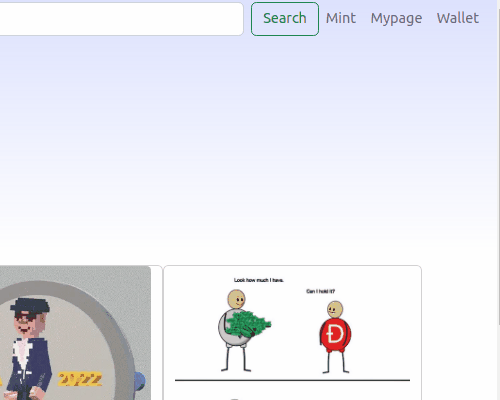
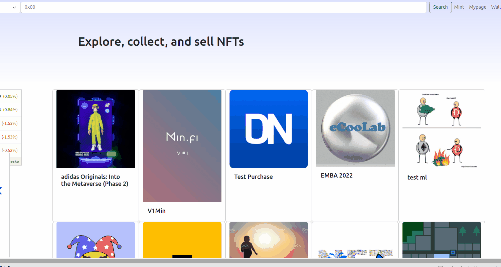
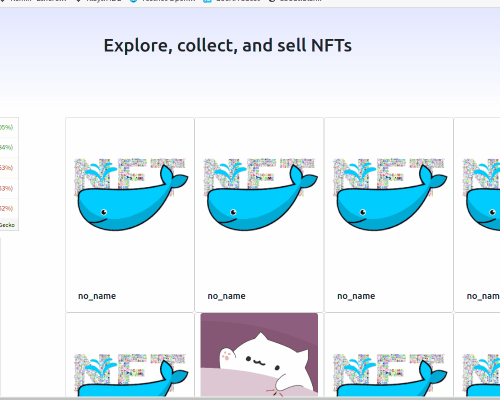
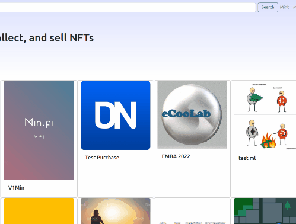

# 👋&nbsp;Introduce
## OpenSee&nbsp;🐳는 NFT를 검색하고 전송하고 민팅을 할 수 있습니다.<br />
<br />

### 📖&nbsp;WIKI [More Information](https://github.com/codestates-beb/BEB-06-FIRST-03/wiki)
<br />
<br />

# 👨‍👨‍👧&nbsp;Members

>**이민욱**&nbsp;&nbsp; https://github.com/yiminwook <br />
>**조은석**&nbsp;&nbsp; https://github.com/noncontact <br />
>**한은진**&nbsp;&nbsp; https://github.com/eunjh3 <br />

<br />
<br />


# ✈️&nbsp;Getting Started
>### Front Client
&nbsp;&nbsp;```npm install```<br />
&nbsp;&nbsp;```npm start```<br />
<br />

>### Back Server
&nbsp;&nbsp; [npm Install nodemon -g nodemon](https://www.npmjs.com/package/nodemon)<br />
&nbsp;&nbsp;.env파일에 [Infura](https://infura.io/) API key입력<br />
&nbsp;&nbsp; ```npm install```<br />
&nbsp;&nbsp; ```npm start```<br />
<br />

>### IPFS Desktop
&nbsp;&nbsp; [Install IPFS](https://docs.ipfs.tech/)&nbsp;&nbsp;/ip4/127.0.0.1/tcp/5001 <br />
&nbsp;&nbsp; CORS 설정 <br />
```
  "API": {
		"HTTPHeaders": {
			"Access-Control-Allow-Origin": [
				"https://webui.ipfs.io",
				"http://webui.ipfs.io.ipns.localhost:8080",
				"http://localhost:3000"
			],
    }
  },
"Gateway": {
		"HTTPHeaders": {
			"Access-Control-Allow-Methods": [
				"GET",
				"POST"
			],
    }
  }
```
<br />
<br />

# Instruction
>### Connect Wallet
<br />
<p align="center">
	
</p>
<br />

>### Search NFT
<br />
<p align="center">
	
</p>
<br />

>### Tranfer NFT
<br />
<p align="center">
	
</p>
<br />

>### Mint NFT
<br />
<p align="center">
	
</p>
<br />
<br />
<br />
